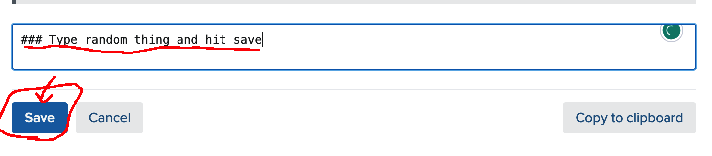
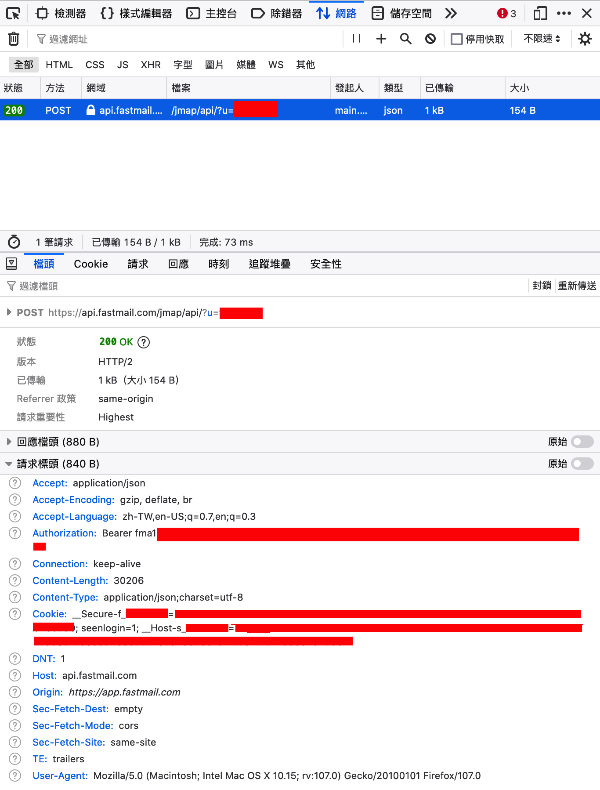

# Sieve rules sync for Fastmail

## Requirement
Python version >3.11 because I use builtin `tomllib` module recently introduced.

## Install
```bash
pip install .
```
## Config
Please look at `config.toml`.

```bash
mkdir ~/.config/sieve-sync
cp config.toml ~/.config/sieve-sync/config.toml
```

### How to get the token and cookie
1. Go into the sieve edit pages.
2. Open you browser developer console
3. Enter something and hit the save button.
4. Look at the request to figure out the token and cookie.
5. fill the value back to `config.toml`

- token has the format: `fma1-XXXXX`
- cookie has the format `__Host-s_XXXXXX=XXXXXXXX`: only this specific cookie is needed after my test

You can look the following screenshots:




## How to use
When you first running; it will insert some commented blocks in your rules
```
#### Managed by Sieve Sync Start ####
#### Managed by Sieve Sync End ####
```

Only the rules in the blocked will be synced.

### Pull from Fastmail
```
sieve-sync --pull
```

It will saved the rules to the `SAVE_LOCATION` in `config.toml`.

<red>I don't do any checking when pulling; all your local edit will be discarded!</red>

### Push to Fastmail
```
sieve-sync --push
```

It will read from `SAVE_LOCATION` and push the update to Fastmail.
<red>It will also pull non-managed contents (outside those commented blocks) to the saved rules.</red>

## Possible Application that builds on Sieve rules sync
### WIP: Masked/Random Email for all domains you own
For the official Masked Email API, you can only select fastmail.com or one of your domains. This is very limited.

This is can be easily achieved by generating a set of sieve rules.

1. Enable Catch-all address for your domain.
2. Use tools to generate random addresses for your domain.
3. Generate Sieve rules automatically to drop mails sent to disabled maksed addressed.

Hope we don't need to this tool anymore in the future when the offical API allows us to set the domain we want.

## Note
This project is mainly a POC.

The API interface for Sieve is not public.

I hope that Fastmail will not prevent us from doing such things before they publish public Sieve API or just support ManageSieve which is already supported by Cyrus IMAP I believe!!


## For Fastmail Staff
Please tell me if using these unpublished API is inappopriate; and I will take it down if asked.
